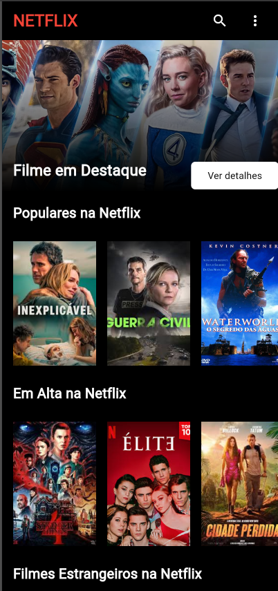
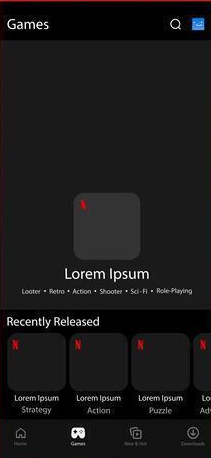

# Atividade - Projeto Netflix

Nosso aplicativo de reprodução Netflix, já possui a tela principal (Home) com as principais categorias de filmes.


### Tela - Home



## Objetivo da Atividade

Escolha uma das categorias da tela Home e desenvolva uma nova tela de categoria seguindo o mockup abaixo:


 
Após criar a tela:

* Adicione um TextButton na categoria escolhida na Home;
* O botão deverá abrir a nova tela utilizando: `MaterialPageRoute`

## Requisitos Técnicos

A nova tela deve conter:

* Scaffold
* AppBar
* Imagem/banner do filme ou série
* Título
* Descrição
* Lista de filmes/séries
* Componentes organizados com:
    * Column
    * Row
    * Container
    * ListView
    * Card
    * Text
    * Image
    * Icon
    * Padding

## Exemplo de Navegação

```dart
TextButton(
  onPressed: () {
    Navigator.push(
      context,
      MaterialPageRoute(
        builder: (context) => TelaCategoria(),
      ),
    );
  },
  child: Text("Abrir Categoria"),
)
```


## Entrega

1. Documentação no Word

Criar uma documentação contendo:

* Nome do projeto
* Objetivo da tela criada
* Componentes utilizados
* Explicação de cada componente
* Prints da aplicação funcionando
* Explicação da navegação entre telas 

2. Envio

* Enviar os arquivos para:
* 📧 barrado.aula@gmail.com
* Data entrega: 12/05

## Critério de Avaliação

| Critério                            | Pontos |
| ----------------------------------- | ------ |
| Criação da nova tela                | 2      |
| Navegação com MaterialPageRoute     | 2      |
| Organização visual                  | 2      |
| Uso correto dos componentes Flutter | 2      |
| Documentação Word                   | 2      |
