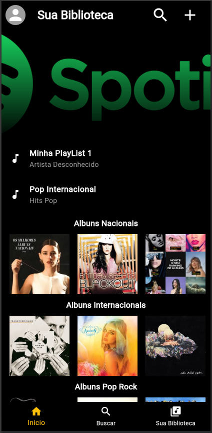
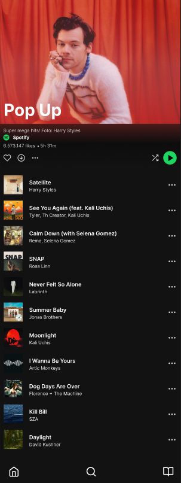

# Atividade - Projeto Spotify

Nosso aplicativo de reprodução Spotify, já possui a tela principal (Home) com as principais categorias

### Tela - Home



## Objetivo da Atividade

Nesta atividade você deverá reproduzir a tela de playlist inspirada no Spotify conforme o modelo apresentado abaixo.



Desenvolver uma tela completa de Playlist utilizando Flutter, reproduzindo:

* Banner da playlist
* Nome da playlist
* Descrição
* Informações da playlist
* Lista de músicas
* Botão Play
* Ícones de ações
* Bottom Navigation Bar
* Tema escuro semelhante ao Spotify

 
Após criar a tela:

* Adicione um TextButton na categoria Playlist escolhida na Home;
* O botão deverá abrir a nova tela utilizando: `MaterialPageRoute`

## Componentes

| Widget                          | Função                 |
| ------------------------------- | ---------------------- |
| `Scaffold`                      | Estrutura principal    |
| `SafeArea`                      | Ajuste da área útil    |
| `AppBar`                        | Barra superior         |
| `Container`                     | Organização visual     |
| `Column`                        | Organização vertical   |
| `Row`                           | Organização horizontal |
| `ListView.builder`              | Lista de músicas       |
| `Image.asset` ou `NetworkImage` | Imagens                |
| `Text`                          | Textos                 |
| `Icon`                          | Ícones                 |
| `CircleAvatar`                  | Imagem circular        |
| `BottomNavigationBar`           | Menu inferior          |
| `Padding`                       | Espaçamento            |
| `Card`                          | Organização visual     |
| `Expanded`                      | Responsividade         |
| `SingleChildScrollView`         | Scroll                 |


## Exemplo de Navegação

```dart
TextButton(
  onPressed: () {
    Navigator.push(
      context,
      MaterialPageRoute(
        builder: (context) => TelaCategoria(),
      ),
    );
  },
  child: Text("Abrir Categoria"),
)
```


## Entrega

1. Documentação no Word

Criar uma documentação contendo:

* Nome do projeto
* Objetivo da tela criada
* Componentes utilizados
* Explicação de cada componente
* Prints da aplicação funcionando
* Explicação da navegação entre telas 

2. Envio

* Enviar os arquivos para:
* 📧 barrado.aula@gmail.com
* Data entrega: 12/05

## Critério de Avaliação

| Critério                            | Pontos |
| ----------------------------------- | ------ |
| Criação da nova tela                | 2      |
| Navegação com MaterialPageRoute     | 2      |
| Organização visual                  | 2      |
| Uso correto dos componentes Flutter | 2      |
| Documentação Word                   | 2      |
