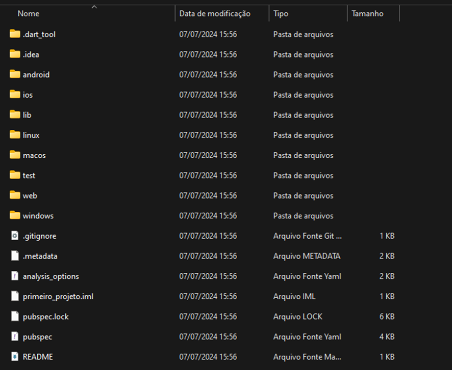
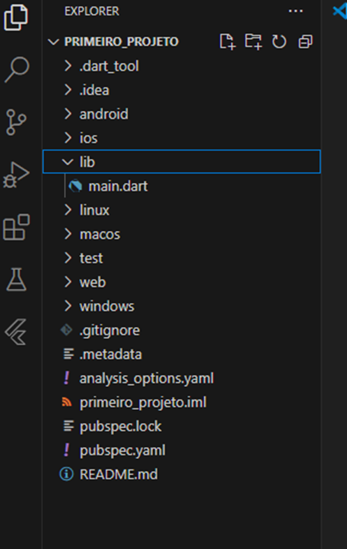

# 📱 Criando projeto Flutter 

## 🪟 Usando o CMD do Windows

### 1️⃣ Abrir o Prompt de Comando

* Windows + R → Digite "cmd" → Enter


### 2️⃣ Navegação e Criação de Pastas

#### Criar uma nova pasta:
```bash
mkdir nome_da_pasta
```

#### Exemplo
```bash
mkdir projetos_flutter
```
#### Acessar a pasta criada:
```bash
cd nome_da_pasta
```
#### Exemplo:
```bash
cd projetos_flutter
```
##  🚀 Criar um projeto Flutter 

###  3️⃣ Comando de criação

```bash
flutter create nome_do_projeto
```
#### 📌 Regras para nome do projeto:

* ✅ Usar letras minúsculas

* ✅ Usar underline (_) para separar palavras

* ❌ Evitar espaços

* ❌ Evitar letras maiúsculas

```bash
flutter create primeiro_projeto
```
### 4️⃣ Aguardar a criação do projeto

O Flutter irá baixar as dependências e criar a estrutura básica:



### 5️⃣ Acessar o projeto criado

```bash
cd primeiro_projeto
```

## 📂 Estrutura do projeto

Após a criação, você verá esta estrutura de pastas:

```bash
primeiro_projeto/
├── 📁 android/          # Configurações específicas do Android
├── 📁 ios/              # Configurações específicas do iOS
├── 📁 lib/              # CÓDIGO FONTE (é aqui que vamos trabalhar!)
├── 📁 test/             # Arquivos de teste
├── 📄 pubspec.yaml      # Gerenciamento de dependências
└── 📄 README.md         # Documentação do projeto
```

# 💻 Abrir código no VS Code

### 6️⃣ Passos para abrir o projeto
1. Abra o Visual Studio Code

2. Clique em File → Open Folder

3. Selecione a pasta do seu projeto

3. Visualização no VS Code



### 7️⃣ Conhecendo a pasta lib
A pasta lib é a mais importante! Ela contém todo o código Dart do seu aplicativo:
```text
📁 lib/
└── 📄 main.dart    # Arquivo principal do aplicativo
```

> Dica: É no arquivo main.dart que faremos todas as nossas modificações iniciais!

# 📱 Criando um Emulador

### 8️⃣ Verificar e criar emulador
Para testar seu aplicativo, precisamos de um emulador (ou dispositivo físico).

### Pelo VS Code:

No canto inferior direito, clique em **"No Device"**

* Selecione **"Create Android Emulator"** ou utilize o emulador do Chrome

* Escolha um dispositivo **(recomendado: Pixel 4)**

* Selecione uma imagem do sistema **(recomendado: API 33)**

* Dê um nome ao emulador e finalize

### Pelo Terminal

```bash
# Listar emuladores disponíveis
flutter emulators

# Criar um novo emulador (se necessário)
flutter emulators --create [nome]

# Iniciar o emulador
flutter emulators --launch [nome_do_emulador]
```

# ▶️ Executando um projeto

### 9️⃣ Comandos para execução
No terminal, dentro da pasta do projeto:

```bash
flutter run
```

## No VS Code:

* Pressione F5

* Ou vá em **Run → Start Debugging**

* Ou clique em "Run" na barra inferior