# Persistência em Banco de Dados

## Estrutura Recomendada

* coleção: `produtos`
* cada documento:
    * `nome`
    * `descricao`
    * `quantidade`
    * `valor`
    * `imagem`
    * `criadoEm`


### Como adicionar ao PATH:
* Pesquise: "variáveis de ambiente"
* Clique em Editar variáveis do sistema
* Clique em Variáveis de Ambiente
* Em "Path" → Editar
* Clique em Novo
* Cole o caminho: `C:\Users\seuusuario\AppData\Local\Pub\Cache\bin`
* OK em tudo

> Feche o `PowerShell`e abra de novo

## Testar

Digite:
```bash
flutterfire --version
C:\Users\seuusuario\AppData\Local\Pub\Cache\bin\flutterfire.bat --version
C:\Users\erika\AppData\Local\Pub\Cache\bin\flutterfire.bat configure
```

Se der erro

```bash
node --version
npm --version
npm install -g firebase-tools
firebase --version
firebase login
```

Para: `✔ Allow Firebase to collect CLI and Emulator Suite usage and error reporting information? No`
```bash
firebase projects:list
C:\Users\erika\AppData\Local\Pub\Cache\bin\flutterfire.bat configure
Se o projeto ainda não existir na sua conta, aí você cria no Firebase Console e depois repete o flutterfire configure. A configuração oficial do Flutter com Firebase usa exatamente esse fluxo.
firebase --version
firebase login
firebase projects:list

```
# Criar o projeto no Firebase Console
1. Abra o Firebase Console

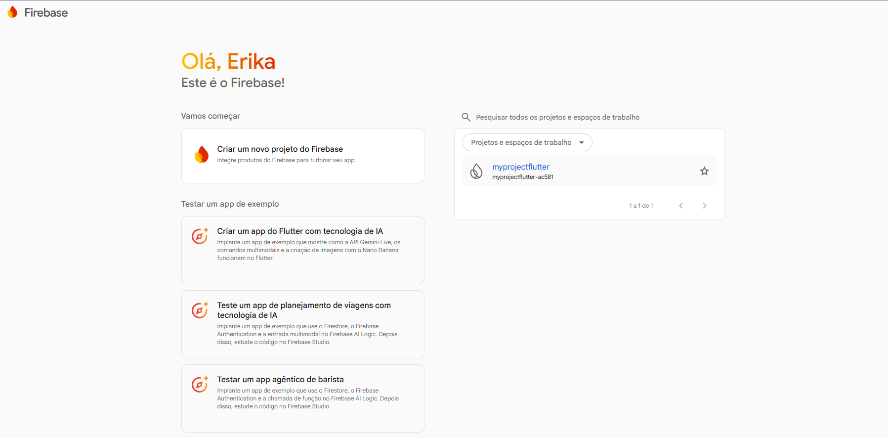

2. Clique em `Add Project`
3. Escolha um nome para o projeto exemplo: `techstore-produtos`
3. Avance nas telas e conclua a criação

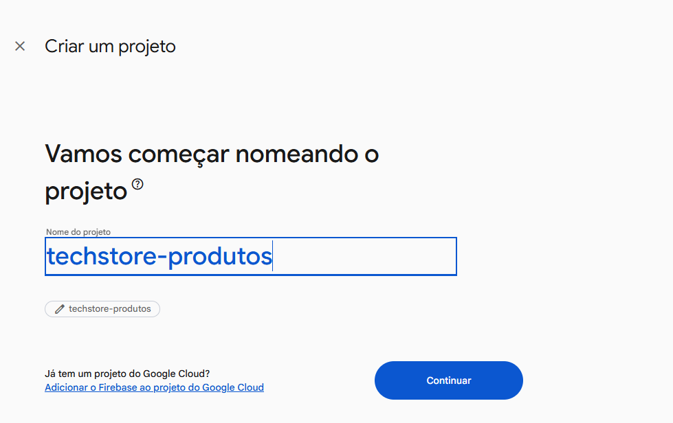

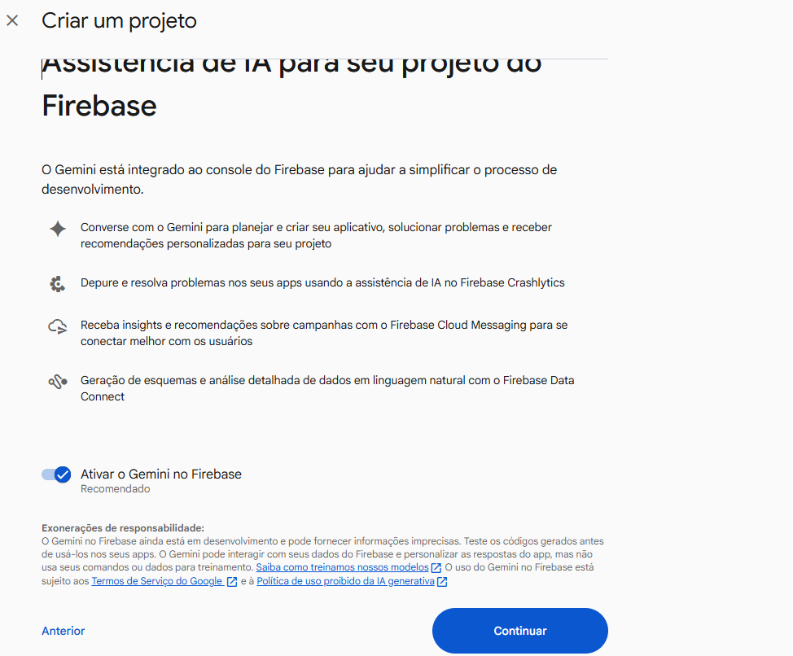


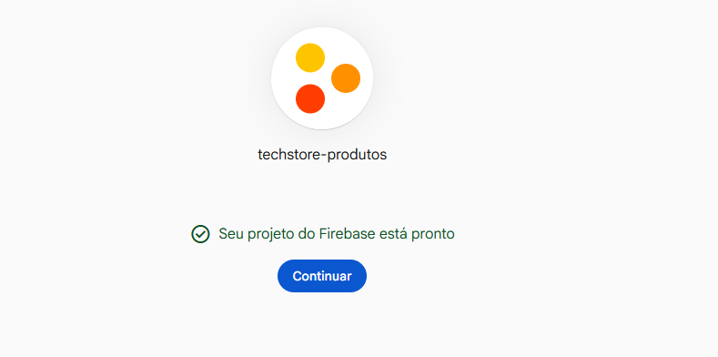

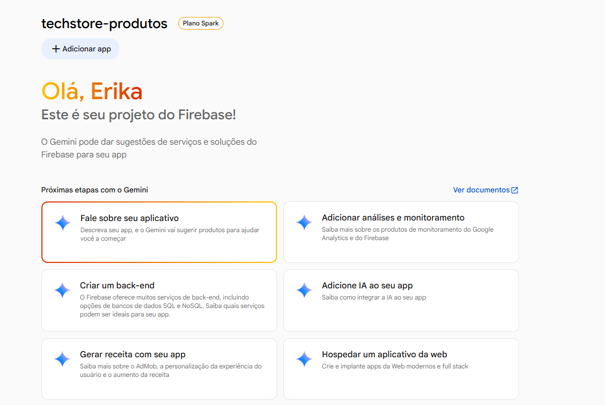

# Criar o banco Cloud Firestore

Com o projeto aberto no console, vá em `Build → Firestore Database → Create database`. Escolha o modo inicial:

1. Clique em `Bancos de dados e ar...`

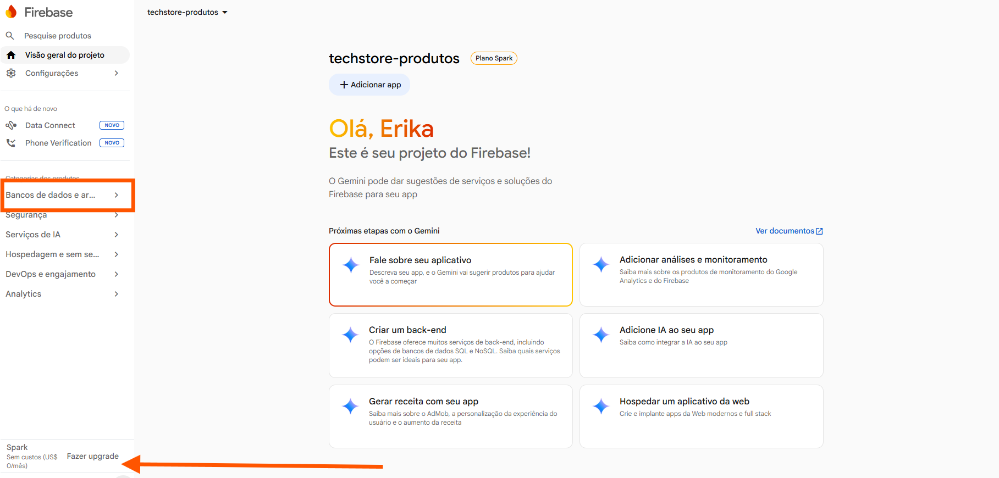

2. Depois em `Firestore`

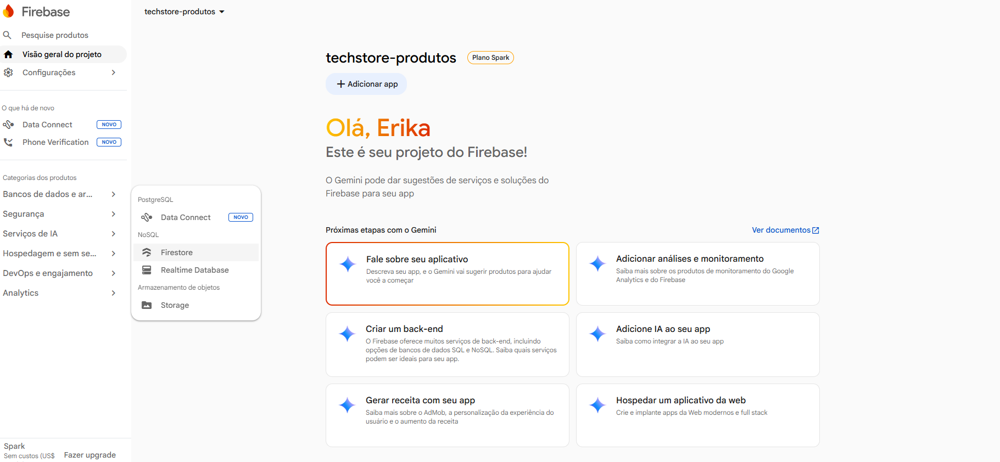

3. Clique em `Criar Banco de Dados`

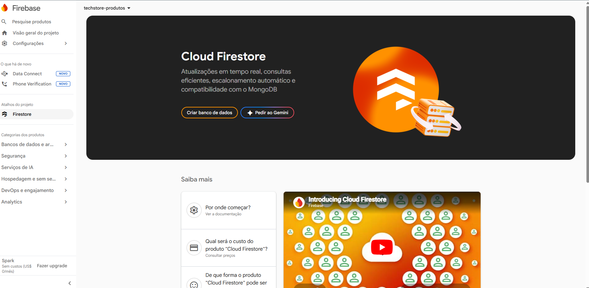

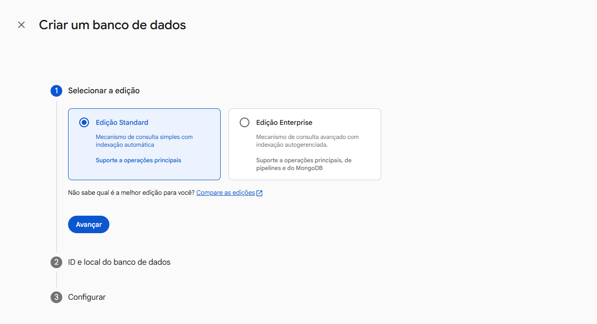

* para nosso projeto: `Test mode`
* para algo mais controlado: `Production mode`

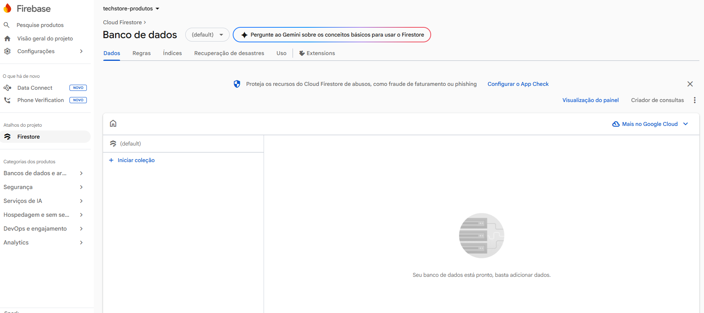


Depois selecione a região e confirme. O Firestore quickstart oficial descreve exatamente esse caminho no console

# Criar as tabelas

No Firestore, os dados ficam em coleções e documentos, e essas coleções/documentos podem ser criados automaticamente na primeira gravação.

Para nosso projeto, em vez de uma tabela produtos, vamos usar uma:

* coleção: `produtos`
* documentos: `cada produto cadastrado`
* campos do documento: `nome, descricao, quantidade, valor, imagem, criadoEm`

## Como criar no Console

Depois de abrir o Cloud Firestore, faça assim:

* Clique em Iniciar coleção ou Start collection.
* Em ID da coleção, digite: `produtos`
* Crie o primeiro documento. Pode deixar o ID automático.
* Adicione os campos.
* Exemplo de campos do primeiro produto:

```text
ID automático
nome: "Notebook Gamer"        (string)
descricao: "Notebook com 16GB RAM"   (string)
quantidade: 10               (int)
valor: 3500.90               (int)
imagem: "notebook.jpg"       (string)
criadoEm: timestamp
```

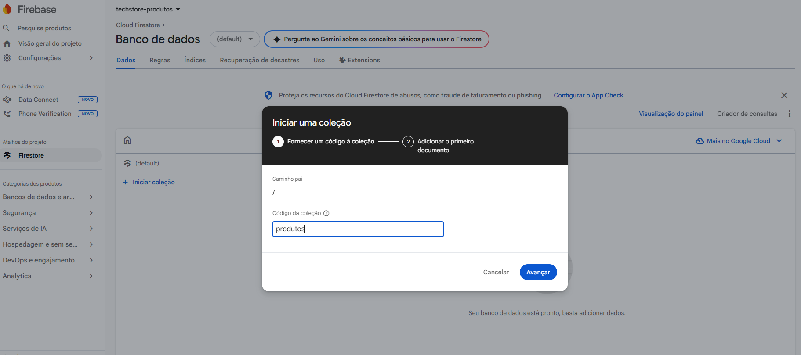

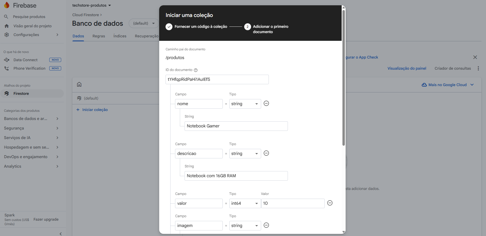

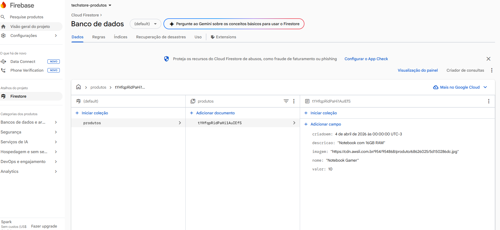

O Firestore organiza tudo justamente nesse modelo de coleção/documento, e a gravação de documentos é a forma padrão de inserir dados.

## Estrutura Visual

```text
produtos
  ├── documento 1
  │     ├── nome
  │     ├── descricao
  │     ├── quantidade
  │     ├── valor
  │     ├── imagem
  │     └── criadoEm
  ├── documento 2
  └── documento 3
```

> “No Firestore não existe tabela como em bancos relacionais. Em vez disso, os dados são organizados em coleções e documentos. No meu projeto, eu usei a coleção produtos, e cada produto cadastrado vira um documento com seus respectivos campos.


# Conectar com Flutter

## Dependências:

No arquivo `pubspec.yaml`, adicione:

```YAML
dependencies:
  flutter:
    sdk: flutter
  firebase_core: ^3.13.0
  cloud_firestore: ^5.6.6
```

Depois no Terminal:

```bash
flutter pub get
dart pub global activate flutterfire_cli
flutterfire configure
ou 
C:\Users\erika\AppData\Local\Pub\Cache\bin\flutterfire.bat configure
```

Para:

You have an existing `firebase.json` file and possibly already configured your project for Firebase. Would you prefer to reuse the values in your existing `firebase.json` file to configure your project? · - digite `no`

* Selecione o seu projeto: `techstore-produtos`
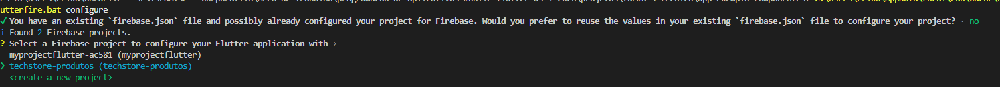
* pressione ENTER
* Escolha a opção `Android`
* Depois de pressionar Enter digite `no` - aguarde

> Rode novamente e selecione `Web`também para funcionar pela Web.

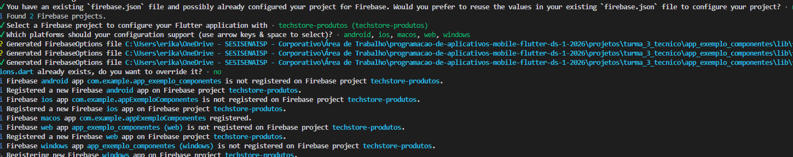

* Isso vai gerar: `firebase_options.dart`

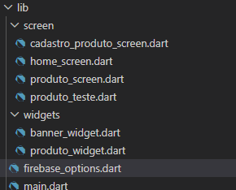

# Configuração `main.dart`

No arquivo `main.dart`altere a função `void main(){}`


```dart
import 'firebase_options.dart';
import 'package:firebase_core/firebase_core.dart';

Future<void> main() async {
  WidgetsFlutterBinding.ensureInitialized();

  await Firebase.initializeApp(
    options: DefaultFirebaseOptions.currentPlatform,
  );

  runApp(const MainApp());
}
``` 

* `Future<void> main() async`
  * `Future<void>` → indica que a função é assíncrona e não retorna valor
* `async` → permite usar await dentro da função

> o app vai esperar operações assíncronas terminarem antes de continuar.

* `WidgetsFlutterBinding.ensureInitialized()`: 
  * inicializa a comunicação entre o Flutter e o sistema (Android/iOS)
  * garante que plugins (como Firebase) funcionem corretamente

* `await Firebase.initializeApp(...)`
  * Inicializando o Firebase no app.

* conecta seu app Flutter ao projeto do Firebase
* prepara serviços como:
* Firestore
* Authentication
* Storage
O await é importante porque:
  * garante que o Firebase esteja pronto antes de usar
  * evita bugs como:
  * “Firebase not initialized”
  * streams não funcionando
  * dados não carregando

* `options: DefaultFirebaseOptions.currentPlatform`
  * Isso vem do arquivo gerado automaticamente:
  ```dart
  firebase_options.dart
  ```
Ele define:

* configuração para Android
* configuração para iOS
* configuração para Web

# Criar o serviço **Firestore** 

Crie: `lib/service/produto_service.dart`


```dart
import 'package:cloud_firestore/cloud_firestore.dart';

class ProdutoService {
  static final FirebaseFirestore _db = FirebaseFirestore.instance;

  static Future<void> salvarProduto({
    required String nome,
    required String descricao,
    required int quantidade,
    required double valor,
    required String imagem,
  }) async {
    await _db.collection('produtos').add({
      'nome': nome,
      'descricao': descricao,
      'quantidade': quantidade,
      'valor': valor,
      'imagem': imagem,
      'criadoEm': FieldValue.serverTimestamp(),
    });
  }

  static Stream<QuerySnapshot<Map<String, dynamic>>> listarProdutos() {
    return _db
        .collection('produtos')
        .orderBy('criadoEm', descending: true)
        .snapshots();
  }
}
```

## Detalhando

```dart
import 'package:cloud_firestore/cloud_firestore.dart';
```

> Importa o pacote oficial do Cloud Firestore para Flutter.

* Cria a classe de `Serviço`

Essa classe serve para:
* centralizar acesso ao Firebase
* evitar código duplicado nas telas
* separar UI de lógica

### 🔹 Instância do Firestore

```dart
static final FirebaseFirestore _db = FirebaseFirestore.instance;
```
* `FirebaseFirestore.instance` → singleton (uma única instância)
* `static` → você usa sem precisar instanciar a classe
* `_db` → privado (boa prática)

> acessa o banco assim:

```dart
_db.collection('produtos')
```
### 🔹 Método salvarProduto

```dart
static Future<void> salvarProduto({...}) async {
```

> Método assíncrono para salvar dados no Firestore


### Parâmetros

```dart
required String nome,
required String descricao,
required int quantidade,
required double valor,
required String imagem,
```

* required → obrigatório passar
* tipagem forte → evita erro

### 🔹 Salvando no Firestore
```dart
await _db.collection('produtos').add({
```

* `collection('produtos')` → acessa (ou cria) a coleção
* `.add({...})`

## Campos

| Campo        | Tipo      | Função          |
| ------------ | --------- | --------------- |
| `nome`       | String    | nome do produto |
| `descricao`  | String    | descrição       |
| `quantidade` | int       | estoque         |
| `valor`      | double    | preço           |
| `imagem`     | String    | URL da imagem   |
| `criadoEm`   | Timestamp | data automática |


### 🔹 FieldValue.serverTimestamp()

* define a data no servidor do Firebase
* evita problemas de horário do celular

```dart
"criadoEm": Timestamp
```

### 🔹 Método listarProdutos

```dart
static Stream<QuerySnapshot<Map<String, dynamic>>> listarProdutos()
```
> Retorna um Stream (tempo real)

Tipo retornado:

```dart
static Stream<QuerySnapshot<Map<String, dynamic>>> listarProdutos() {
  return _db.collection('produtos').snapshots();
}
```

* Stream = fluxo contínuo de dados
* QuerySnapshot = resultado de uma consulta
* Map<String, dynamic> = cada documento é um mapa de chave e valor


# Conectar com sua tela de cadastro

```dart
#produto_screen.dart

import 'package:app_exemplo_componentes/screen/cadastro_produto_screen.dart';
import 'package:app_exemplo_componentes/services/produto_service.dart';
import 'package:app_exemplo_componentes/widgets/produto_widget.dart';
import 'package:cloud_firestore/cloud_firestore.dart';
import 'package:flutter/material.dart';

class ProdutoScreen extends StatelessWidget {
  const ProdutoScreen({super.key});

  int _toInt(dynamic value) {
    if (value == null) return 0;
    if (value is int) return value;
    if (value is double) return value.toInt();
    if (value is String) return int.tryParse(value) ?? 0;
    return 0;
  }

  double _toDouble(dynamic value) {
    if (value == null) return 0.0;
    if (value is int) return value.toDouble();
    if (value is double) return value;
    if (value is String) return double.tryParse(value) ?? 0.0;
    return 0.0;
  }

  @override
  Widget build(BuildContext context) {
    return Scaffold(
      appBar: AppBar(
        title: const Text(
          'Produtos',
          style: TextStyle(
            fontSize: 18,
            fontWeight: FontWeight.bold,
            fontFamily: 'Arial',
          ),
        ),
        backgroundColor: Colors.black,
        foregroundColor: Colors.white,
        actions: [
          IconButton(
            tooltip: 'Cadastrar produto',
            icon: const Icon(Icons.add),
            onPressed: () {
              Navigator.push(
                context,
                MaterialPageRoute(
                  builder: (context) => const CadastroProdutoScreen(),
                ),
              );
            },
          ),
        ],
      ),
      body: StreamBuilder<QuerySnapshot<Map<String, dynamic>>>(
        stream: ProdutoService.listarProdutos(),
        builder: (context, snapshot) {
          if (snapshot.connectionState == ConnectionState.waiting) {
            return const Center(
              child: CircularProgressIndicator(),
            );
          }

          if (snapshot.hasError) {
            return Center(
              child: Text('Erro ao carregar produtos: ${snapshot.error}'),
            );
          }

          if (!snapshot.hasData || snapshot.data!.docs.isEmpty) {
            return const Center(
              child: Text('Nenhum produto cadastrado'),
            );
          }

          final produtos = snapshot.data!.docs;

          return ListView.separated(
            padding: const EdgeInsets.all(12),
            itemCount: produtos.length,
            separatorBuilder: (_, __) => const SizedBox(height: 10),
            itemBuilder: (context, index) {
              final doc = produtos[index];
              final produto = doc.data();

              final String nome = produto['nome']?.toString() ?? '';
              final String descricao = produto['descricao']?.toString() ?? '';
              final int quantidade = _toInt(produto['quantidade']);
              final double valor = _toDouble(produto['valor']);
              final String imagem = produto['imagem']?.toString() ?? '';

              return ProdutoWidget(
                nome: nome,
                descricao: descricao,
                quantidade: quantidade,
                valor: valor,
                imagem: imagem,
              );
            },
          );
        },
      ),
      floatingActionButton: FloatingActionButton(
        backgroundColor: Colors.red,
        foregroundColor: Colors.white,
        child: const Icon(Icons.add),
        onPressed: () {
          Navigator.push(
            context,
            MaterialPageRoute(
              builder: (context) => const CadastroProdutoScreen(),
            ),
          );
        },
      ),
    );
  }
}
```

### Método `_toInt`

```dart
int _toInt(dynamic value) {
  if (value == null) return 0;
  if (value is int) return value;
  if (value is double) return value.toInt();
  if (value is String) return int.tryParse(value) ?? 0;
  return 0;
}
```

* Esse método converte qualquer valor para inteiro.


### Método `_toDouble`

```dart
double _toDouble(dynamic value) {
  if (value == null) return 0.0;
  if (value is int) return value.toDouble();
  if (value is double) return value;
  if (value is String) return double.tryParse(value) ?? 0.0;
  return 0.0;
}
```

* Mesma ideia, só que agora para double

### Método build

```dart 
@override
Widget build(BuildContext context) {
```

* Esse método monta toda a interface da tela.

### `body` com `StreamBuilder`

```dart
body: StreamBuilder<QuerySnapshot<Map<String, dynamic>>>(
```

Ele escuta o Firestore e reconstrói a interface sempre que houver alteração.

### Stream recebido

```dart
stream: ProdutoService.listarProdutos(),
```

### `builder`

```dart
builder: (context, snapshot) {
```
* `snapshot`:  representa o estado atual dos dados recebidos pelo stream.

Ele pode estar:

* carregando
* com erro
* com dados
* vazio

### Estado de carregamento

```dart
if (snapshot.connectionState == ConnectionState.waiting) {
  return const Center(
    child: CircularProgressIndicator(),
  );
}
```

Enquanto o Firestore ainda está carregando, mostra o círculo de loading.

### Estado de Erro

```dart
if (snapshot.hasError) {
  return Center(
    child: Text('Erro ao carregar produtos: ${snapshot.error}'),
  );
}
```
Se acontecer erro na consulta, mostra a mensagem.

Exemplo:
* problema de internet
* regra do Firestore bloqueando leitura
* erro de configuração


### Lista vazia


```dart
if (!snapshot.hasData || snapshot.data!.docs.isEmpty) {
  return const Center(
    child: Text('Nenhum produto cadastrado'),
  );
}
```
Se não existir dado ou a coleção estiver vazia, mostra mensagem centralizada.

### Pegando os documentos

```dart
final produtos = snapshot.data!.docs;
```

Aqui você pega a lista de documentos retornados pelo Firestore.

Cada item dessa lista é um documento da coleção produtos.


### ListView.separated

```dart
return ListView.separated(
```
Mostra a lista de produtos.

* `padding`:
```dart
padding: const EdgeInsets.all(12),
```
Adiciona espaço interno nas bordas da lista.

* `itemCount`
```dart
itemCount: produtos.length,
```
Quantidade de itens da lista.

* `separatorBuilder`

```dart
separatorBuilder: (_, __) => const SizedBox(height: 10),
```
Cria espaço entre um item e outro.

* `itemBuilder`
```dart
itemBuilder: (context, index) {
```
Esse método monta cada produto individualmente.

## Pegando o documento atual

```dart
final doc = produtos[index];
final produto = doc.data();
```
* doc é o documento do Firestore
* doc.data() devolve os campos desse documento em formato de mapa

```dart
{
  'nome': 'Cadeira',
  'descricao': 'Cadeira gamer',
  'quantidade': 3,
  'valor': 899.90,
  'imagem': 'https://...',
}
```

## Extraindo os campos

```dart
final String nome = produto['nome']?.toString() ?? '';
final String descricao = produto['descricao']?.toString() ?? '';
final int quantidade = _toInt(produto['quantidade']);
final double valor = _toDouble(produto['valor']);
final String imagem = produto['imagem']?.toString() ?? '';
```
Aqui você prepara os valores para mandar ao widget.

## Montando o ProdutoWidget

```dart
return ProdutoWidget(
  nome: nome,
  descricao: descricao,
  quantidade: quantidade,
  valor: valor,
  imagem: imagem,
);
```
Esse widget recebe os dados do produto e exibe visualmente na tela.


## Tela de Produtos

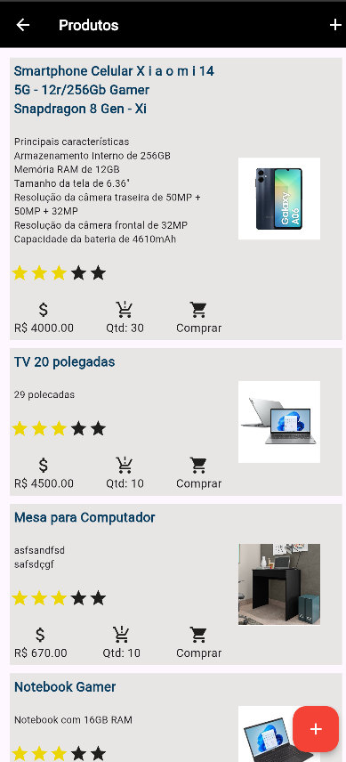